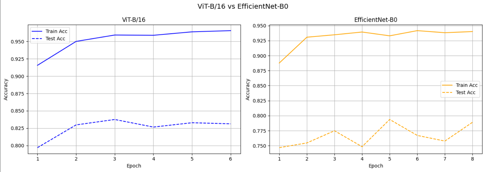

# 🫁 Chest X-Ray Pneumonia Classification

Binary image classification to detect **pneumonia** from chest X-ray images using transfer learning.  
Two models compared: **ViT-B/16** vs **EfficientNet-B0** — with early stopping and TensorBoard experiment tracking.

---

## 📊 Results

| Model | Best Test Accuracy | Stopped At Epoch |
|---|---|---|
| ViT-B/16 | **83.75%** ✅ | 6 |
| EfficientNet-B0 | 79.37% | 8 |

**ViT-B/16 won** — despite being a larger model with less inductive bias, it generalized better on this dataset without augmentation.

---

## 🔍 Key Findings

- **Aggressive augmentation hurt EfficientNet** — RandomRotation + ColorJitter confused the model on medical images that have very specific visual patterns
- **ViT outperformed EfficientNet** on this dataset, contrary to the common assumption that smaller models perform better with limited data
- **Early stopping was essential** — both models started overfitting after epoch 3-4 (train acc ~96% vs test acc ~83%)
- **Transfer learning was highly effective** — only the classification head was trained, yet both models achieved strong results

---

## 🗂️ Dataset

[Chest X-Ray Images (Pneumonia)](https://www.kaggle.com/datasets/paultimothymooney/chest-xray-pneumonia) — Kaggle

- **Train:** 5,216 images (NORMAL / PNEUMONIA)
- **Test:** 624 images
- **Classes:** NORMAL, PNEUMONIA

---

## 🏗️ Project Structure

```
chest-xray-pneumonia-classification/
│
├── train.py                  # Main training script
├── models.py                 # build_vit(), build_efficientnet()
├── dataset.py                # SafeImageFolder, get_dataloaders()
├── utils.py                  # EarlyStopping, create_writer()
├── requirements.txt          # Dependencies
├── experiment_results.png    # Accuracy curves comparison
└── README.md
```

---

## ⚙️ Models & Setup

### ViT-B/16
- Pre-trained on ImageNet-21k
- All layers frozen except classification head
- Head: `Dropout(0.3) → Linear(768, 2)`
- No augmentation (default ViT transform)

### EfficientNet-B0
- Pre-trained on ImageNet
- All layers frozen except classifier
- Classifier: `Dropout(0.3) → Linear(1280, 2)`
- Augmentation: RandomHorizontalFlip, RandomRotation(15°), ColorJitter

### Training Config
```python
optimizer  = Adam(lr=0.001)
loss_fn    = CrossEntropyLoss()
epochs     = 10 (with early stopping, patience=3)
batch_size = 32
```

---

## 📈 Experiment Tracking

TensorBoard used for real-time loss and accuracy monitoring across both experiments.

```bash
%load_ext tensorboard
%tensorboard --logdir runs
```



---

## 🚀 How to Run

1. Clone the repo
```bash
git clone https://github.com/dogukanada74/chest-xray-pneumonia-classification.git
cd chest-xray-pneumonia-classification
```

2. Install dependencies
```bash
pip install -r requirements.txt
```

3. Add your `kaggle.json` to the project folder, then run
```bash
python train.py
```

> The script will automatically download the dataset via Kaggle API, detect the correct folder structure, clean Mac metadata files, and start training.

---

## 📦 Requirements

```
torch>=1.12
torchvision>=0.13
kaggle
tqdm
matplotlib
tensorboard
Pillow
```

---

## 🧠 What I Learned

- Transfer learning with Vision Transformers and CNNs
- Experiment tracking with TensorBoard
- Early stopping implementation from scratch
- Data augmentation strategies for medical imaging
- Kaggle API dataset management
- Debugging real-world dataset issues (corrupted files, nested zip structures)

---

## 👤 Author

**Doğukan Ada**  
2nd Year Computer Engineering Student  
Muğla Sıtkı Koçman University  

[](https://linkedin.com/in/dogukanada)
[](https://github.com/dogukanada74)
